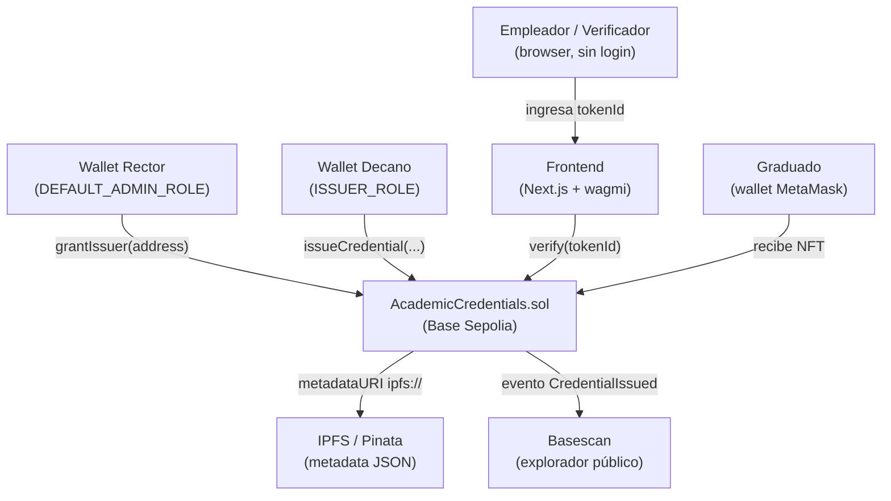
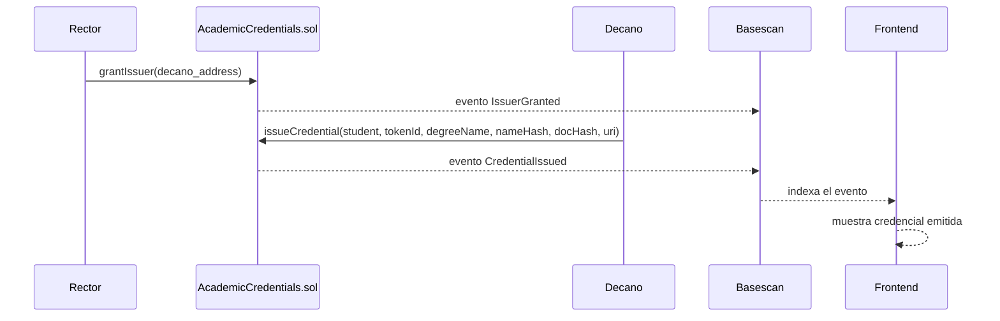
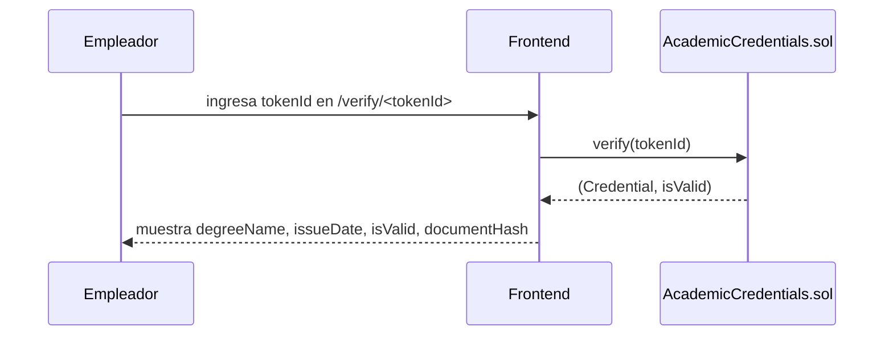

# AcademicCredentials, Sistema de Certificación de Títulos UNQ

**Diplomatura Blockchain UNQ, Módulo 3**
**Integrante:** Maximiliano Cacace
**Docentes:** Dr. David Petrocelli, Esp. Ciro Edgardo Romero
**Año:** 2026

---

## Parte 0, Hook UNQ

### ¿Qué problema resuelve?

Argentina tiene un problema documentado de diplomas falsos. La "Operación Alejo" expuso más de 500 títulos fraudulentos en circulación. En 2021, un médico ejerció en Río Cuarto con un título falsificado que nunca fue detectado por los sistemas actuales. La UNQ emite sus títulos a través de SIDCER, un sistema centralizado donde la verificación depende de un funcionario que responda un mail o atienda el teléfono, proceso que puede tardar semanas.

### ¿Qué área de la UNQ operaría el sistema?

La Secretaría Académica de la UNQ, con el Rectorado como autoridad máxima (`DEFAULT_ADMIN_ROLE`) y los decanos de cada unidad académica como emisores (`ISSUER_ROLE`). El sistema no reemplaza a SIDCER, sino que agrega una capa de verificación pública e instantánea sobre los títulos ya emitidos.

### ¿Quién se beneficia?

- **Graduados** que tramitan reconocimiento de títulos en el exterior: presentan el `tokenId` y el empleador o institución verifica en segundos sin contactar a la UNQ.
- **Empleadores** que contratan profesionales: verifican la autenticidad del título en Basescan sin intermediarios.
- **La UNQ**: reduce la carga operativa de verificaciones manuales y elimina la posibilidad de falsificación del documento on-chain.

### ¿Por qué blockchain y no una base de datos firmada?

Una base de datos firmada sigue siendo centralizada: si la UNQ cae, si el servidor es hackeado, o si un funcionario modifica un registro, no hay forma pública de detectarlo. Con blockchain, cada emisión es un evento inmutable, público y verificable por cualquier persona sin depender de la universidad. La referencia más directa es la Universidad Nacional de Córdoba, ganadora del IMetaRed TIC 2025, que implementó un sistema similar y redujo el tiempo de verificación de títulos de 4 meses a 2 semanas.

---

## Parte 0.2, Arquitectura y Modelado

### Diagrama de componentes



### Justificación del struct `Credential`

```solidity
struct Credential {
    string   degreeName;       // nombre del grado, en texto plano, dato público
    bytes32  studentNameHash;  // keccak256 del nombre, privacidad por commitment
    uint256  issueDate;        // block.timestamp, trazabilidad temporal
    bytes32  documentHash;     // keccak256 del PDF original, integridad del documento
    bool     active;           // false si fue revocado
}
```

**¿Por qué `studentNameHash` y no el nombre en texto?**
El nombre es un dato personal protegido por GDPR y la Ley 25.326 de Argentina. Almacenarlo en texto plano en blockchain lo haría público e inmutable para siempre. El hash permite verificar que "Juan Pérez" es el titular sin exponer el nombre a terceros que solo tienen el hash.

**¿Por qué `documentHash` separado de `metadataURI`?**
`metadataURI` apunta a un JSON en IPFS que puede contener foto, firma y más datos. `documentHash` es el `keccak256` del PDF del diploma. Si la universidad pierde el JSON de IPFS (el pin expira, Pinata cierra), el `documentHash` on-chain sigue siendo la prueba de integridad del PDF original, que el graduado puede conservar localmente.

**¿Qué pasa si la universidad pierde el JSON de IPFS?**
El contrato on-chain conserva `degreeName`, `studentNameHash`, `issueDate` y `documentHash`. La validez del título no depende de IPFS. La metadata adicional (foto, firma) se pierde, pero la prueba de existencia y validez del título permanece.

### Flujo de emisión



### Flujo de verificación pública



---

## Setup local

```bash
git clone https://github.com/dpetrocelli/diplo-unq-blockchain-clase3.git
cd diplo-unq-blockchain-clase3
forge install
forge build
forge test
forge coverage
```

Resultado esperado: `34 passed; 0 failed`, cobertura `100%` en `AcademicCredentials.sol`.

---

## Comandos principales

```bash
forge build              # compilar
forge test               # tests
forge test -vvv          # con detalle
forge coverage           # cobertura
anvil                    # nodo local
```

### Deploy local (con anvil corriendo)

```bash
forge create src/AcademicCredentials.sol:AcademicCredentials \
  --rpc-url http://localhost:8545 \
  --private-key 0xac0974bec39a17e36ba4a6b4d238ff944bacb478cbed5efcae784d7bf4f2ff80 \
  --broadcast
```

### Deploy a Base Sepolia

```bash
cast wallet import dev-wallet --interactive

forge create src/AcademicCredentials.sol:AcademicCredentials \
  --rpc-url https://sepolia.base.org \
  --account dev-wallet \
  --broadcast
```

### Emitir una credencial

```bash
export ADDR=<dirección del contrato>
export STUDENT=<wallet del estudiante>

cast send $ADDR \
  "issueCredential(address,uint256,string,bytes32,bytes32,string)" \
  $STUDENT 1 "Licenciatura en Sistemas" \
  $(cast keccak "Juan Perez") \
  $(cast keccak "pdf-bytes-placeholder") \
  "ipfs://bafy.../credential-1.json" \
  --rpc-url https://sepolia.base.org \
  --account dev-wallet
```

### Verificar una credencial

```bash
cast call $ADDR "verify(uint256)" 1 --rpc-url https://sepolia.base.org
```

---

## Estructura del repositorio

```
.
├── src/
│   └── AcademicCredentials.sol    # contrato principal
├── test/
│   └── AcademicCredentials.t.sol  # 34 tests (unit + fuzz), 100% cobertura
├── script/
│   └── Deploy.s.sol               # script de deploy
├── SECURITY.md                    # análisis Slither + análisis propio
├── foundry.toml
└── remappings.txt
```

---

## Funciones del contrato

| Función | Rol requerido | Descripción |
|---------|--------------|-------------|
| `grantIssuer(address)` | `DEFAULT_ADMIN_ROLE` | Otorga `ISSUER_ROLE` a un emisor |
| `revokeIssuer(address)` | `DEFAULT_ADMIN_ROLE` | Revoca `ISSUER_ROLE` de un emisor |
| `issueCredential(student, tokenId, degreeName, studentNameHash, documentHash, metadataURI)` | `ISSUER_ROLE` | Emite una credencial y almacena todos los campos |
| `revoke(tokenId, reason)` | `ISSUER_ROLE` | Revoca una credencial con motivo |
| `verify(tokenId)` | Cualquiera | Retorna `(Credential, isValid)` |

---

## Contrato en Base Sepolia

> Completar tras el deploy:

- **Dirección del contrato:** `pending`
- **Basescan:** `pending`
- **Credencial 1:** `pending`
- **Credencial 2:** `pending`
- **Credencial 3:** `pending`
- **Frontend:** `pending`
- **Video demo:** `pending`

---

## Recursos

- OpenZeppelin Wizard: https://wizard.openzeppelin.com/#custom
- Consigna del trabajo final: https://dpetrocelli.github.io/diplounq2026/tp-final.html
- Base Sepolia faucet: https://www.coinbase.com/faucets/base-ethereum-sepolia-faucet
- Basescan: https://sepolia.basescan.org
